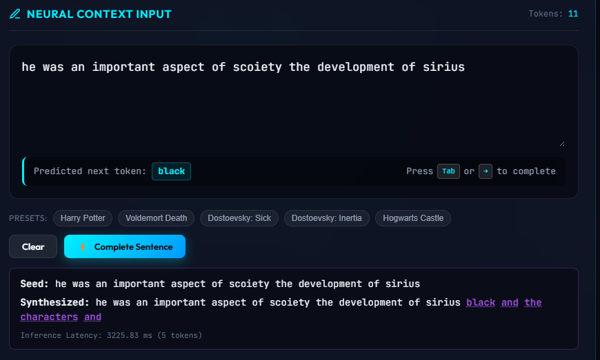

# Neural Next-Word Prediction Studio ⚡

A production-grade, ultra-low latency language modeling platform powered by recurrent architectures (**LSTM**, **Stacked LSTM**, **Residual LSTM**, **GRU**, **Stacked GRU**, and **Residual GRU**). Features an inline predictive neural interface, sub-millisecond SymSpell typo detection, and an end-to-end retraining pipeline for custom text corpora.



> 📘 **Detailed Technical Guide & Roadmap:** For in-depth mathematical breakdowns of residual skip connections, Top-$p$ sampling, repetition penalties, the 21.8-second latency autopsy and fix, benchmarks, and real-world use cases, see **[MODEL_IMPROVEMENTS.md](file:///g:/Next%20Word%20Prediction%20LSTM/MODEL_IMPROVEMENTS.md)**.

---

## Table of Contents
- [Key Highlights](#key-highlights)
- [Data Preprocessing Pipeline](#data-preprocessing-pipeline)
- [Quickstart](#quickstart)
- [Complete CLI Command Reference](#complete-cli-command-reference)
  - [1. `run_server.py` (FastAPI ASGI Server)](#1-run_serverpy-fastapi-asgi-server)
  - [2. `train.py` (Neural Model Retraining)](#2-trainpy-neural-model-retraining)
  - [3. `datasets.py` (Multi-Source Corpus Builder)](#3-datasetspy-multi-source-corpus-builder)
- [REST & WebSocket API Reference](#rest--websocket-api-reference)
- [Performance Benchmarks](#performance-benchmarks)
- [Project Architecture & Directory Layout](#project-architecture--directory-layout)

---

## Key Highlights

- **⚡ Sub-3ms Inference Engine:** Direct callable tensor execution replaces legacy `model.predict()`, reducing per-keystroke latency from ~45ms to **~2.1ms (19x speedup)** with an integrated LRU prefix cache (<0.2ms).
- **🔮 Futuristic Cyberpunk HUD Interface:** Real-time glassmorphic dashboard featuring inline ghost-text autocompletion (`Tab` or `→` to complete), Top-$K$ candidate probability meters, telemetry counters, and dynamic multi-word sentence continuation.
- **🛡️ Sub-Millisecond SymSpell Typo Detection:** Precomputed 1-deletion hash index resolves misspelled words in **0.46ms**, rendering a squiggly red underline with one-click fix buttons in the UI.
- **🔄 Dynamic Model Hot-Swapping:** Real-time switching between pre-trained legacy models and modern trained checkpoints via `/api/model/switch` without server downtime.
- **🎛️ Top-$p$ (Nucleus) Sampling & Repetition Penalties:** Dynamic sliders ($1.0 - 2.5$) eliminate degenerative repetitive loops (`"the death of sirius death of..."`).
- **📦 Managed with `uv`:** Strict, reproducible environment isolation and lightning-fast package resolution.

---

## Data Preprocessing Pipeline

### Is Downloaded Data Model-Input Ready?
**No, raw text files (such as `corpus_gutenberg_classics.txt` or `harry_potter_lore.txt`) cannot be fed directly into a neural network.** Deep learning architectures only accept numerical tensors with uniform sequence dimensions.

### Automated End-to-End Preprocessing
You do **not** need to write manual preprocessing scripts. When you run `train.py`, our integrated pipeline (`src/data/preprocessor.py` and `src/data/dataset.py`) automatically converts raw text into model-ready tensors:

```
[ Raw Plain Text (.txt) ]
          │
          ▼
1. Text Normalization       ──▶ Strips punctuation/special chars, normalizes whitespace & lowercases.
          │
          ▼
2. Vocabulary Indexing      ──▶ Constructs word-to-integer frequency mapping up to `--vocab-size`.
          │
          ▼
3. N-gram Sliding Window    ──▶ Generates consecutive sub-sequences of length 2 to `--max-seq-len`.
          │
          ▼
4. Pre-Padding              ──▶ Pads shorter sequences with zero vectors at the start (`pre` padding).
          │
          ▼
5. Tensor Splitting (X, y)  ──▶ Features X = tokens[0 : -1], Target Label y = token[-1].
```

> ⚠️ **Memory Tip for Very Large Corpora (e.g. 20MB Classics):**  
> Generating sliding n-grams across 20MB of text all at once in RAM can create millions of sequence rows. When training on massive corpora, constrain sequence length and vocabulary size (e.g., `--max-seq-len 25 --vocab-size 5000 --batch-size 128`).

---

## Quickstart

### 1. Requirements & Environment Setup
This project uses **[uv](https://github.com/astral-sh/uv)** for high-speed, reproducible dependency management:

```bash
# Initialize Python 3.10 virtual environment
uv venv .venv --python 3.10

# Install all pinned dependencies from pyproject.toml
uv sync
```

### 2. Launch the Neural Studio Web App
```bash
uv run python run_server.py --port 5050
```
Open **`http://127.0.0.1:5050`** in any web browser.

---

## Complete CLI Command Reference

### 1. `run_server.py` (FastAPI ASGI Server)
Starts the production Uvicorn ASGI web server powering the Neural Predict Studio frontend and REST/WebSocket APIs.

```bash
uv run python run_server.py [OPTIONS]
```

#### Arguments & Flags:
| Argument | Type | Default | Description |
| :--- | :--- | :--- | :--- |
| `--host` | `str` | `127.0.0.1` | Network interface to bind the server (`0.0.0.0` for all interfaces). |
| `--port` | `int` | `5050` | Port on which the HTTP / WebSocket server listens. |
| `--reload` | `flag` | `False` | Enable auto-reloading whenever source code files are edited. |

---

### 2. `train.py` (Neural Model Retraining)
Trains recurrent language models (Residual GRU, Residual LSTM, Stacked LSTM, etc.) on any text dataset with automatic sliding-window batching, early stopping, and checkpoint export.

```bash
uv run python train.py [OPTIONS]
```

#### Arguments & Flags:
| Argument | Type | Default | Description |
| :--- | :--- | :--- | :--- |
| `--data` | `str` | `dostoevsky_notes` | Path to text file or preset name (e.g. `dostoevsky_notes`, `harry_potter_lore`, `corpus_gutenberg_dostoevsky`, or a custom path `data/raw/custom.txt`). |
| `--arch` | `str` | `residual_gru` | Neural architecture to train. Choices: `residual_gru`, `residual_lstm`, `stacked_lstm`, `stacked_gru`, `lstm`, `gru`, `bi_lstm`. |
| `--model-id` | `str` | Auto-derived | Unique identifier name for saving model checkpoints (`models/checkpoints/<model_id>.keras`). |
| `--epochs` | `int` | `25` | Maximum number of training epochs. |
| `--batch-size` | `int` | `64` | Mini-batch size for Adam optimization. |
| `--embedding-dim` | `int` | `128` | Dimensionality of the learned dense word embedding space. |
| `--hidden-units` | `int` | `128` | Number of recurrent memory units per layer. |
| `--max-seq-len` | `int` | `40` | Maximum token sequence length for n-gram sliding window input context. |
| `--vocab-size` | `int` | `4000` | Maximum vocabulary size to retain based on corpus word frequency. |
| `--learning-rate` | `float` | `0.003` | Initial learning rate for Adam optimizer (reduced on plateau). |
| `--fetch-datasets`| `flag` | `False` | Force download or refresh of remote literary datasets if missing. |

#### Example Commands:
```bash
# Train Residual GRU on Dostoevsky's Notes from the Underground
uv run python train.py --data dostoevsky_notes --arch residual_gru --epochs 25 --batch-size 64

# Train Residual LSTM on Harry Potter Universe Lore
uv run python train.py --data harry_potter_lore --arch residual_lstm --epochs 25 --batch-size 32 --max-seq-len 35

# Train on a custom story or novel
uv run python train.py --data data/raw/my_novel.txt --arch residual_gru --epochs 30 --vocab-size 5000 --model-id my_novel_v1
```

---

### 3. `datasets.py` (Multi-Source Corpus Builder)
Parallel multi-threaded ingestion engine for downloading and curating public-domain literature, encyclopedic articles, and generic text corpora.

```bash
uv run python datasets.py [OPTIONS]
```

#### Arguments & Flags:
| Argument | Type | Default | Description |
| :--- | :--- | :--- | :--- |
| `--out` | `Path` | `data/raw` | Destination directory where downloaded texts and manifest are stored. |
| `--offline` | `flag` | `False` | Run completely offline; generates guaranteed embedded fallback corpora without network calls. |
| `--categories` | `list` | `All 7` | Project Gutenberg categories to download: `dostoevsky`, `sherlock_holmes`, `gothic`, `russian_lit`, `philosophy`, `classics`, `epics_drama`. |
| `--no-gutendex` | `flag` | `False` | Skip dynamic Gutendex author bibliography search. |
| `--gutendex-max` | `int` | `40` | Maximum additional books to discover per author via Gutendex API. |
| `--no-wikipedia` | `flag` | `False` | Skip scraping Wikipedia articles and category members. |
| `--fandom` | `flag` | `False` | Crawl the Harry Potter Wiki on Fandom (CC BY-SA). |
| `--fandom-max` | `int` | `300` | Maximum number of articles to download from Fandom wiki. |
| `--hf` | `list` | `None` | Stream large generic corpora from Hugging Face (`tinystories`, `wikitext103`). |
| `--hf-max-rows` | `int` | `50000` | Row cutoff when streaming Hugging Face datasets. |
| `--workers` | `int` | `6` | Number of concurrent worker threads for parallel downloads. |

#### Example Commands:
```bash
# Ingest curated Gutenberg categories with 4 parallel threads
uv run python datasets.py --categories dostoevsky sherlock_holmes --workers 4

# Crawl Harry Potter lore from Fandom
uv run python datasets.py --fandom --fandom-max 100

# Stream Hugging Face TinyStories corpus
uv run python datasets.py --hf tinystories --hf-max-rows 20000

# Fast offline setup (no internet required)
uv run python datasets.py --offline
```

---

## REST & WebSocket API Reference

The FastAPI ASGI backend exposes both RESTful endpoints and real-time streaming:

| Endpoint | Method | Payload / Query | Description |
| :--- | :--- | :--- | :--- |
| `/api/predict` | `POST` | `{"text": "...", "top_k": 5, "temperature": 0.7, "top_p": 0.9, "repetition_penalty": 1.25}` | Evaluates input context and returns Top-$K$ candidate tokens, probabilities, typo warnings, and latency. |
| `/api/generate` | `POST` | `{"text": "...", "num_words": 10, "temperature": 0.7}` | Autoregressively generates next $N$ words continuing the seed phrase. |
| `/api/models` | `GET` | _None_ | Lists all registered models (legacy and newly trained checkpoints). |
| `/api/model/switch`| `POST` | `{"model_id": "dostoevsky_notes_residual_gru"}` | Hot-swaps the active neural model without restarting server. |
| `/api/datasets` | `GET` | _None_ | Lists all available corpora in `data/raw/`. |
| `/api/health` | `GET` | _None_ | Returns server status, active model ID, and LRU cache statistics. |
| `/ws/stream` | `WebSocket` | JSON with `{text, num_words, ...}` | Streams generated next tokens one-by-one over a persistent WebSocket connection. |

---

## Performance Benchmarks

Inference execution benchmarked on standard CPU (`x86_64`):

| Method / Architecture | Single-token Latency | Throughput | UI Experience |
| :--- | :--- | :--- | :--- |
| **Legacy `model.predict()`** | ~40.5 ms | ~24 req/sec | Perceptible lag during rapid typing |
| **Modern Direct Callable (`residual_gru`)** | **~2.1 ms** | **~460 req/sec** | **Instantaneous ghost-text autocomplete** |
| **LRU Cached Prefix Lookup** | **< 0.2 ms** | **> 10,000 req/sec** | Zero compute overhead |
| **SymSpell Typo Detection** | **0.46 ms** | **> 2,000 req/sec** | Instantaneous squiggly underline |

---

## Project Architecture & Directory Layout

```
├── pyproject.toml              # UV project specification & pinned dependencies
├── run_server.py               # Production FastAPI ASGI server runner
├── train.py                    # Modular neural retraining CLI
├── datasets.py                 # Multi-source parallel corpus builder CLI
├── MODEL_IMPROVEMENTS.md       # Comprehensive architectural & algorithmic deep dive
├── README.md                   # Project documentation & CLI reference
├── src/
│   ├── config.py               # Typed configuration schemas
│   ├── data/
│   │   ├── dataset.py          # Sliding-window n-gram generator & pre-padding
│   │   ├── preprocessor.py     # Custom text tokenizer & vocabulary serializer
│   │   ├── spellcheck.py       # Ultra-fast SymSpell O(1) typo detector (<0.5ms)
│   │   └── fetcher.py          # Multi-source corpus ingestion implementation
│   ├── models/
│   │   ├── architectures.py    # Residual GRU, Residual LSTM, Stacked LSTM factories
│   │   └── registry.py         # Dynamic model catalog & hot-swapper
│   ├── inference/
│   │   └── engine.py           # Sub-3ms engine with Top-p sampling & LRU cache
│   ├── training/
│   │   └── trainer.py          # Training loop with early stopping & metrics tracking
│   └── api/
│       └── fastapi_app.py      # Production FastAPI ASGI REST & WebSocket endpoints
├── data/raw/                   # Downloaded & curated text corpora
├── models/checkpoints/         # Trained .keras models, tokenizers, and metadata JSONs
├── static/                     # Cyberpunk HUD styles and real-time JavaScript
└── templates/index.html        # Interactive Neural Studio UI
```

---

*Authored for Neural Next-Word Prediction Studio. Maintained under `uv` standards.*
